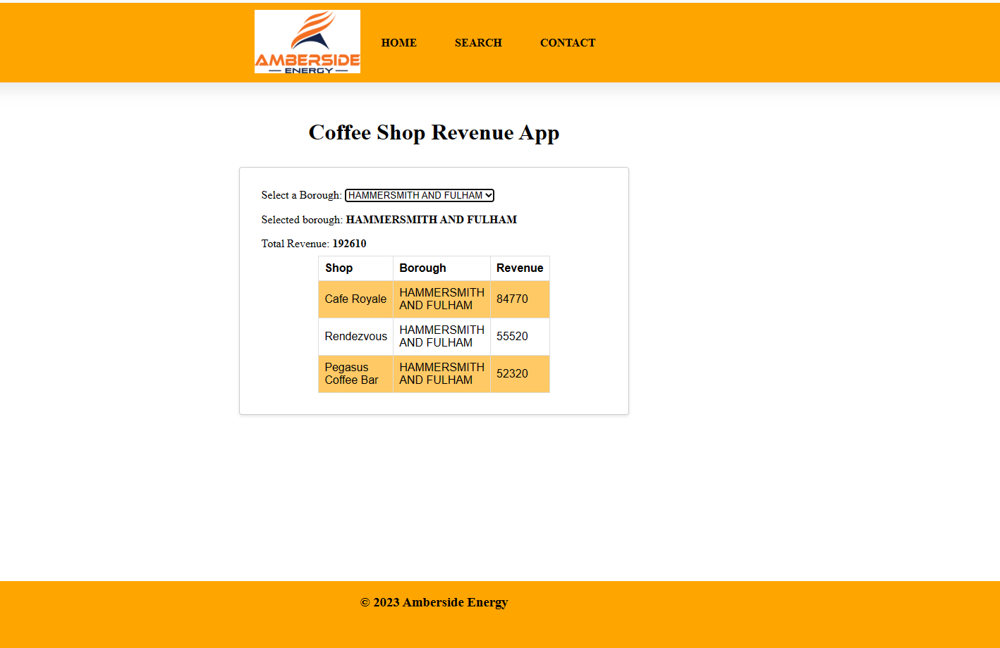

# Coffee Shop Revenue App

The Coffee Shop Revenue App is a web application built with Python, Django, JavaScript, HTML5, and CSS3. This application primarily functions as an
interface for people to work with the API running in API servers.




## **Technologies Used**

### Languages Used

* [HTML5](https://developer.mozilla.org/en-US/docs/Web/Guide/HTML/HTML5)
* [CSS3](https://developer.mozilla.org/en-US/docs/Archive/CSS3#:~:text=CSS3%20is%20the%20latest%20evolution,flexible%20box%20or%20grid%20layouts.)
* [JavaScript](https://developer.mozilla.org/en-US/docs/Web/JavaScript)
* [Python](https://www.python.org/)

### Dependencies
- Django	4.2.1	
- asgiref	3.6.0	
- certifi	2023.5.7
- charset-normalizer	3.1.0	
- idna	3.4
- pip	22.3.1	
- requests	2.30.0	
- setuptools	65.5.1	
- sqlparse	0.4.4	
- tzdata	2023.3	
- urllib3	2.0.2
- wheel	0.38.4	


# Getting Started
1) Fork or git clone this repository. 
git clone https://github.com/KonstantinaStrantzali/junior-software-engineer-test TEST-FOLDER
2) Inside your local repository, install the dependencies in the server directory. This is the API server that serves the data.
- cd TEST-FOLDER
- cd server
- npm install
Run the API server in dev mode
 ``` npm run dev -- --open ```
This should run the API server in http://localhost:3000/
3) Create a virtual environment using virtualenv: ``` virtualenv venv ```

4) Activate the virtual environment:
- For Unix/Linux:``` source venv/bin/activate ```
- For Windows: ``` venv\Scripts\activate ```


5) Install the project dependencies: ``` pip install -r requirements.txt```

6) Run the server ```python manage.py runserver```